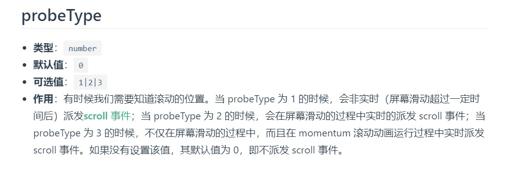
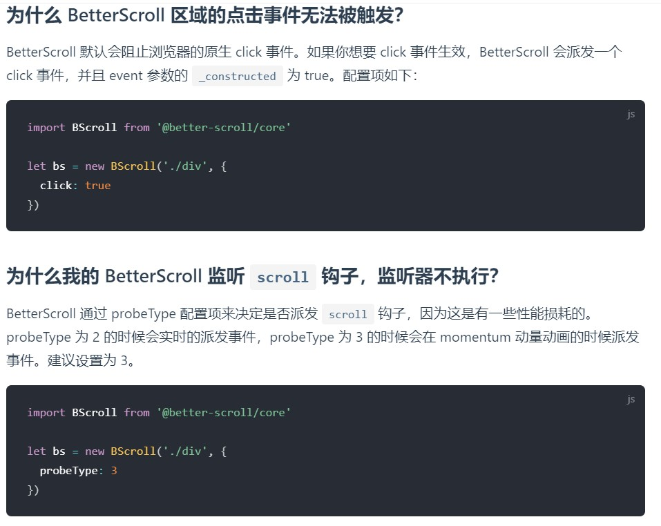

<!-- # 
 betterScroll踩坑记录
 -->

1. 使用BetterScroll刚`npm run serve`时无法进行滑动，需要修改BetterScroll的源码，
      修改`BetterSC/shared-utils/src/dom.ts` 中的常量hasTouch为true, 
      这样就可以在初始化时对参数进行设置,把一切掌握在自己手中

      使用方法如下:
        new BScroll时,在参数options中加入

        mouseWheel: true,   //开启鼠标滚轮
        disableMouse: false,   //启用鼠标拖动
        disableTouch: false    //启用手指触摸
      参考博客：https://www.cnblogs.com/mldonkey/p/11421577.html

2. 使用BetterScroll后绑定scroll, click事件后无法触发，也无报错 
    BetterScroll默认拦截了click事件可在`new Bscroll()`的配置对象中传入` click: true`
3. 使用BetterScroll的`scroll`事件必须同时在`new Bscroll()`配置对象中指定`probeType` 

(后面发现官网都有说明... 链接：https://better-scroll.github.io/docs/zh-CN/FAQ/#%E4%B8%BA%E4%BB%80%E4%B9%88%E6%88%91%E7%9A%84-betterscroll-%E7%9B%91%E5%90%AC-scroll-%E9%92%A9%E5%AD%90%EF%BC%8C%E7%9B%91%E5%90%AC%E5%99%A8%E4%B8%8D%E6%89%A7%E8%A1%8C%EF%BC%9F)

. 使用better-scroll时注意$nextTick的使用