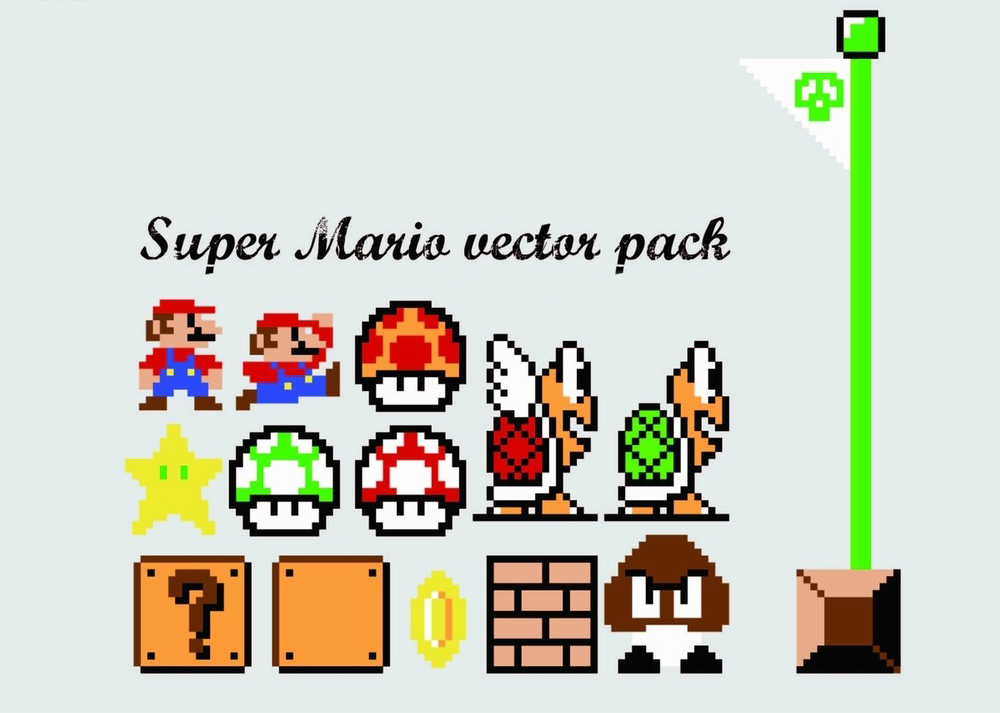
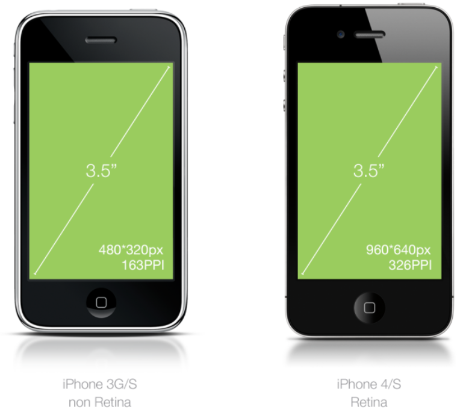
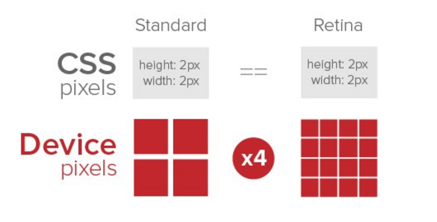
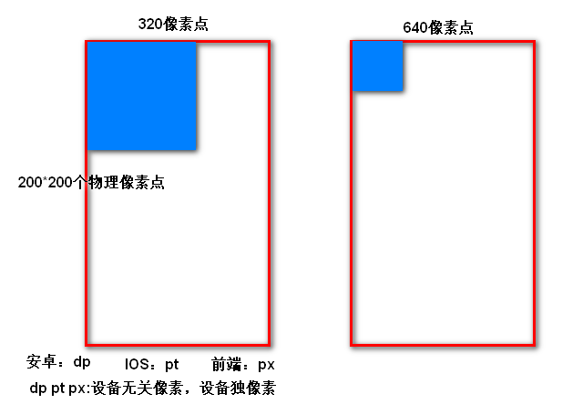

# 移动端

## 1. 视口

> 目标：了解布局视口、视觉视口、理想视口

**视口**（viewport）:就是浏览器显示页面内容的屏幕区域, 视口可以分为**布局视口**、**视觉视口**和**理想视口**

### 1.1 布局视口 layout viewport

* **概念**: 为了解决早期pc端页面在移动端的显示问题，一般移动端的浏览器设置的默认视口，成为布局视口

* **大白话**：浏览器默认的窗口宽度

* **布局视口大小**：iOS, Android基本都将这个视口分辨率设置为 **980px**，所以PC上的网页大多都能在手机上呈现，只不过元素看上去很小，一般默认可以通过手动缩放网页

  

### 1.2 视觉视口 visual viewport

* **概念**：字面意思，它是**用户正在看到的网站的区域**。注意：是网站的区域。

  我们可以通过缩放去操作视觉视口，但不会影响布局视口，布局视口仍保持原来的宽度

* 

### 1.3 理想视口 ideal viewport

* **概念**：布局视口的一个理想尺寸，只有当**布局视口（浏览器）的尺寸等于设备屏幕的尺寸**时，才是理想视口

* **设置理想视口方法**：**mate标签**

  

* **最标准的viewport设置**
  * 视口宽度和设备保持一致
  * 视口的默认缩放比例1.0
  * 不允许用户自行缩放
  * 最大允许的缩放比例1.0
  * 最小允许的缩放比例1.0

## 2. 二倍图

> 目标：了解屏幕分辨率、了解图片分辨率、了解视网膜屏、会使用background-size设置背景图的大小、会使用二倍精灵图设置元素背景

### 2.1 手机屏幕

- 通常我们所指的屏幕`尺寸`，实际上指的是屏幕对角线的长度（一般用英寸来度量）如下图所示
- 1英寸 = 2.54cm **绝对单位**；（到哪都不会变的值）

### 2.2 物理像素（采光点）

* **概念**：客观存在。指计算机显示设备中的最小单位，即一个像素点的大小。每一个像素点可以理解为就是**屏幕上的一个发光点**。每个点可以发一个颜色，就是我们看到的画面
* **发展**：早期的屏幕，物理像素点（客观的小灯泡）都比较大，比如玩游戏的超级玛丽的画面的颗粒感很强：随着技术的进步，物理像素点会被做的越来越小；会被做小；

### 2.3 屏幕分辨率

- **概念**：物理像素点的个数来衡量，表示屏幕水平和垂直方向的物理像素点的个数
- iPhone3和iPhone4是同一个屏幕尺寸下，比较分辨率：

* **分辨率高的优势**：直观感受，画面细腻；**Retina（视网膜屏幕）**是一种显示技术，可以将把更多的物理像素点压缩至一块屏幕里；从而达到更高的分辨率，并提高屏幕显示的细腻程度，即**1px代表更多的物理像素**
* **CSS像素  px** ：1px代表的长度是固定的，因此屏幕分辨率越高，1px代表的物理像素就越多

### 2.4 图片分辨率

- **概念**：指图片横纵方向各有多少个物理像素（光点）

- 下图：分辨率640*426 ，提供了多少个色彩发光点（迎合物理像素点）；

* **一个萝卜一个坑**：图片在手机上展示时，图片的光点会对应手机的光点（即物理像素点和物理像素点对接）

  图片的光点比作萝卜，手机的采光点比作坑，光点是一一对应的，所以称：一个萝卜一个坑

* 假设：**有200*200分辨率**的图片，在不设置图片宽高的情况下，展示在宽度分别是320（iphone3）、640(iphone4)分辨率的手机上，展示的效果如下：

  

- **问题**：相同的图片不设置宽高，在不同的设备下，展示的大小不一样
  - 宽度：第2个是第1个的0.5倍；
  - 面积：第2个是第1个的1/4倍；
- **原因**：
  - 200*200分辨率的图片：200个颜色发光点（萝卜）；
  - 一个物理像素点发一个颜色：一个萝卜一个坑，屏幕都需要200个物理像素点；
  - 坑的宽度大小：320（1）；640（0.5）；
  - 所以显示为上图。
- **目标**：显示大小一样；
- **解决方法**
  * 直接设置图片宽高相同（不建议）：图片在分辨率高的设备上会模糊
  * **UI提供二倍图**

